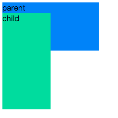

## 彻底搞懂CSS层叠上下文、层叠等级、层叠顺序、z-index
### 认知误区  
一直以为z-index就是描述定义一个元素在屏幕z轴上的堆叠顺序。z-index值越大在z轴上就越靠上，也就是离屏幕观察者越近。然后，这个认知存在很大问题:  
1. 首先，z-index属性值并不是在任何元素上都有效果。它仅在定位元素（定义了position属性，且属性值为非static值的元素）上有效果  
2. 判断元素在Z轴上的堆叠顺序，不仅仅是直接比较两个元素z-index值大小，这个堆叠顺序实际是由元素的层叠上下文、层叠等级共同决定  
我们先看看上面提到的层叠上下文、层叠等级、层叠顺序都是什么？
### 什么是层叠上下文？  
层叠上下文，是html中一个三维的概念。在css2.1规范中，每个盒模型的位置时三维的，分别是平面上的x轴，y轴以及表示层叠的z轴。一般情况下，元素在页面上沿x轴y轴平铺，我们察觉不到他在z轴上的层叠关系。而一旦元素发生堆叠，这时就能发现某个元素可能覆盖了另一个元素或者被另一个元素覆盖。  
如果一个元素含有层叠上下文（也就是说它是层叠上下文元素），我们可以理解为这个元素在z轴上就高人一等，最终表现为它离屏幕观察者更近
### 什么事层叠等级
- 在同一个层叠上下文中，它描述定义的是该层叠上下文中的层叠上下文元素在z轴上的上下顺序
- 在普通元素中，他描述定义的是这些普通元素在z轴上的上下顺序  
注意:
1. 普通元素的层叠等级由其所在的层叠上下文决定  
2. 层叠等级的比较只有在当前层叠上下文元素中才有意义。不同层叠上下文中比较层叠等级是没有意义的
### 如何产生层叠上下文  
1. html中的根元素 html,本身就具有层叠上下文，称为“根层叠上下文”
2. 普通元素设置position属性为非static值并设置z-index属性为具体值，产生层叠上下文  
3. css3中的新属性也可以产生层叠上下文  

栗子1: 有两个div，p.a、p.b被包裹在一个div里，p.c被包裹在另一个盒子里，只为.a、.b、.c设置position和z-index属性
```js
<style>
  div {  
    position: relative;  
    width: 100px;  
    height: 100px;  
  }  
  p {  
    position: absolute;  
    font-size: 20px;  
    width: 100px;  
    height: 100px;  
  }  
  .a {  
    background-color: blue;  
    z-index: 1;  
  }  
  .b {  
    background-color: green;  
    z-index: 2;  
    top: 20px;  
    left: 20px;  
  }  
  .c {  
    background-color: red;  
    z-index: 3;  
    top: -20px;  
    left: 40px;  
  }
</style>

<body>  
  <div>  
    <p class="a">a</p>  
    <p class="b">b</p>  
  </div> 

  <div>  
    <p class="c">c</p>  
  </div>  
</body> 
```
  
因为p.a,p.b,p.c三个的父元素div没有设置z-index,所以不会产生层叠上下文，所以.a,.b,.c都处于html根元素产生的“根层叠上下文中”,属于同一个层叠上下文，此时谁的z-index大，谁就在上面  
栗子2：有两个div, p.a,p.b被包裹在一个div里，p.c被包裹在另一个盒子里，同时为两个div,.a,.b,.c设置position和z-index属性
```js
<style>
  div {
    width: 100px;
    height: 100px;
    position: relative;
  }
  .box1 {
    z-index: 2;
  }
  .box2 {
    z-index: 1;
  }
  p {
    position: absolute;
    font-size: 20px;
    width: 100px;
    height: 100px;
  }
  .a {
    background-color: blue;
    z-index: 100;
  }
  .b {
    background-color: green;
    top: 20px;
    left: 20px;
    z-index: 200;
  }
  .c {
    background-color: red;
    top: -20px;
    left: 40px;
    z-index: 9999;
  }
</style>

<body>
  <div class="box1">
    <p class="a">a</p>
    <p class="b">b</p>
  </div>

  <div class="box2">
    <p class="c">c</p>
  </div>
</body>

```
  
我们发现虽然p.c的z-index为9999，远大于p.a,p.b的z-index值，但是由于p.a,p.b的父元素div.box1产生的层叠上下文的z-index的值为2，p.c的父元素div.box2所产生的层叠上下文的z-index值为1，所以p.c永远在p.a和p.b的下面  
同时，如果我们只改变p.a,p.b的z-index值，由于这两个元素都在父元素div.box1产生的层叠上下文中，所以，谁的z-index大，谁就在上面。  
### 什么事层叠顺序 
  
在不考虑css3的情况下，当元素发生层叠时，层叠顺序遵循上面的规则  
1. 左上角“background/border”指的是层叠上下文元素的背景和边框  
2. inline/inline-block元素的层叠顺序要高于block块级和float浮动元素 
3. 单纯考虑层叠顺序，z-index:auto和z-index:0在同一级，但这两个属性本身是由本质区别的
> 于上面第2条，为什么inline/inline-block元素的层叠顺序要高于block(块级)/float(浮动)元素？这个大家可以思考一下！
其实很简单，像border/background属于装饰元素的属性，浮动和块级元素一般用来页面布局，而网页设计之初最重要的就是文字内容，所以在发生层叠时会优先显示文字内容，保证其不被覆盖  
### 你要的套路  
当遇到元素层叠时，如何清晰的判断它们谁在上谁在下呢？  
1. 首先先看要比较的两个元素是否处于同一层叠上下文中:  
  1.1 如果是，谁的层叠等级大，谁就在上面（怎么判断层叠等级大小呢？ -层叠顺序图）  
  1.2 如果两个元素不在同一层叠上下文中，请先比较它们所处的层叠上下文的层叠等级
2. 当两个元素层叠等级相同，层叠顺序相同，在dom结构中后面元素的层叠等级在前面元素之上
```js
<head>
    <style>
        .box1,
        .box2 {
            position: relative;
            z-index: auto;
        }

        .child1 {
            width: 200px;
            height: 100px;
            background: #168bf5;
            position: absolute;
            top: 0;
            left: 0;
            z-index: 2;
        }

        .child2 {
            width: 100px;
            height: 200px;
            background: #32c292;
            position: absolute;
            top: 0;
            left: 0;
            z-index: 1;
        }
    </style>
</head>

<body>
    <div class="box1">
        <div class="child1">child1</div>
    </div>

    <div class="box2">
        <div class="child2">child2</div>
    </div>

</body>
```
  
说明: .box1/.box2虽然设置position:relative,但是z-index:auto的情况下，这两个元素还是普通元素，并没有产生层叠上下文，所以.child1/.child2属于html元素的“根元素层叠上下文”中，此时，谁的z-index大，谁就在上面  
栗子4:  
对于栗子3中的css代码，我们只把.box1/.box2的z-index属性值改为数值0，其余不变
```js
.box1, .box2 {
  position: relative;
  z-index: 0;
}
...

```
  
说明: 此时，我们发现，仅仅修改了.box1/.box2的z-index属性值改为数值0，最终结果完全相反。这时，child2覆盖在了child1上面。原因是什么呢？很简单:因为设置z-index:0后，.box1/.box2产生了各自的层叠上下文，这时候要比较child1和child2的层叠关系，完全由父元素决定，但是.box1和.box2的z-index都为0，都是块级元素（所以他们的层叠等级，层叠顺序都是相同的），这种情况下，在dom结构中后面的覆盖前面的，所以.child2就在上面  
## CSS3中的属性对层叠上下文的影响  
1. 父元素的display属性值为flex|inline-flex，子元素z-index属性值不为auto的时候，子元素为层叠上下文元素；  
2. 元素的opacity属性值不是1；
3. 元素的transform属性值不是none；
4. 元素mix-blend-mode属性值不是normal
5. 元素的filter属性值不是none；
6. 元素的isolation属性值是isolate；
8. will-change指定的属性值为上面任意一个；
9. 元素的-webkit-overflow-scrolling属性值设置为touch
```js
<style>
  .box {
  }
  .parent {
    width: 200px;
    height: 100px;
    background: #168bf5;
    /* 虽然设置了z-index，但是没有设置position，z-index无效，.parent还是普通元素，没有产生层叠上下文 */
    z-index: 1;
  }
  .child {
    width: 100px;
    height: 200px;
    background: #32d19c;
    position: relative;
    z-index: -1;
  }
</style>

<body>
  <div class="box">
    <div class="parent">
      parent
      <div class="child">child</div>
    </div>
  </div>
</body>

```
  
说明: 我们发现，.child被parent覆盖了。虽然parent设置z-index属性值，但是没有设置position属性，z-index无效，所以没有产生层叠上下文，parent还是普通的块级元素。此时，在层叠顺序规则中，z-index值小于0的child会被普通的block块级元素parent覆盖  
栗子6:
对于上面的栗子，我们只修改.box的属性，设置display: flex，其余属性和DOM结构不变。
```js
.box {
  display: flex;
}

```
  
说明:当给box设置diplay: flex时，parent就变成层叠上下文元素，根据层叠顺序规则，层叠上下文的background/border的层叠等级小于z-index值小于0的元素的层叠等级，所以z-index值-1的child在parent上面
```js
<style>
  .parent {
    width: 100px;
    height: 200px;
    background: #168bf5;
    position: absolute;
    top: 0;
    left: 0;
    z-index: 0;
  }
  .child1 {
    width: 100px;
    height: 200px;
    background: #32d19c;
    position: absolute;
    top: 20px;
    left: 20px;
    z-index: 1;
  }
  .child2 {
    width: 100px;
    height: 200px;
    background: #e4c950;
    position: absolute;
    top: 40px;
    left: 40px;
    z-index: -1;
  }
  .child2-1 {
    width: 100px;
    height: 200px;
    background: #e45050;
    position: absolute;
    top: 60px;
    left: 60px;
    z-index: 9999;
  }
  .child2-2 {
    width: 100px;
    height: 200px;
    background: #db68a7;
    position: absolute;
    top: 80px;
    left: 40px;
    z-index: -9999;
  }
</style>
<body>
  <div class="parent">
    parent
    <div class="child1">child1</div>
    <div class="child2">
      child2
      <div class="child2-1">child2-1</div>
      <div class="child2-2">child2-2</div>
    </div>
  </div>
</body>

```
  
参考文章:  
[深入理解CSS中的层叠上下文和层叠顺序](https://www.zhangxinxu.top/wordpress/2016/01/understand-css-stacking-context-order-z-index/)  
[CSS 中的z-index属性](https://blog.csdn.net/weixin_40672882/article/details/81183321)