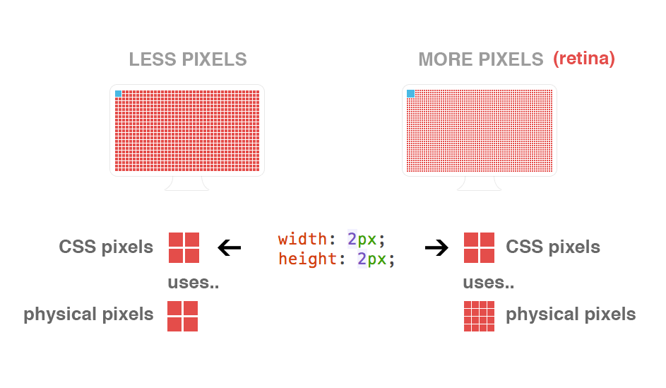
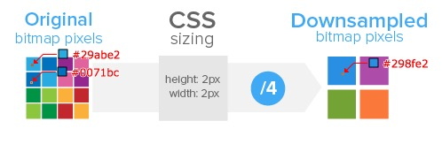
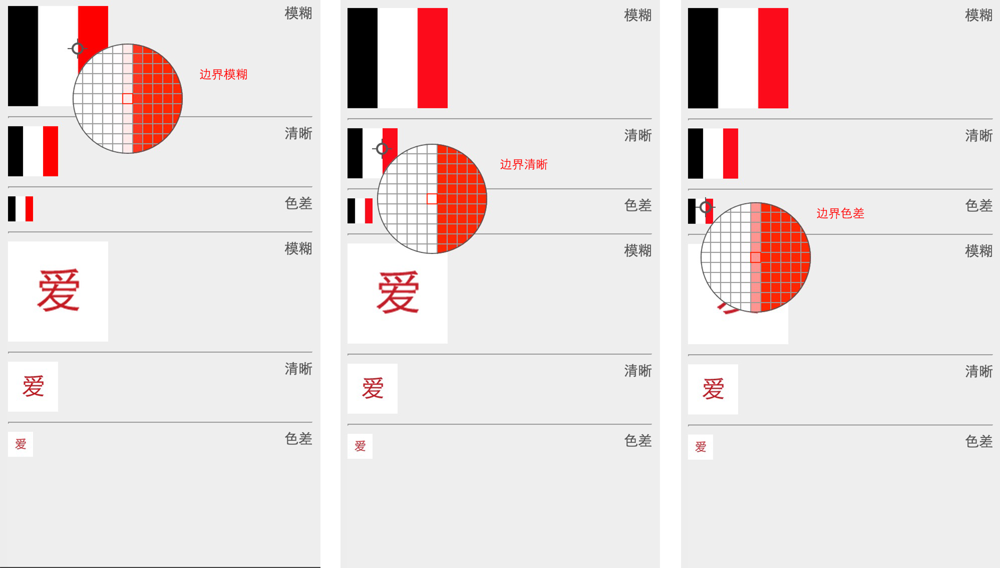
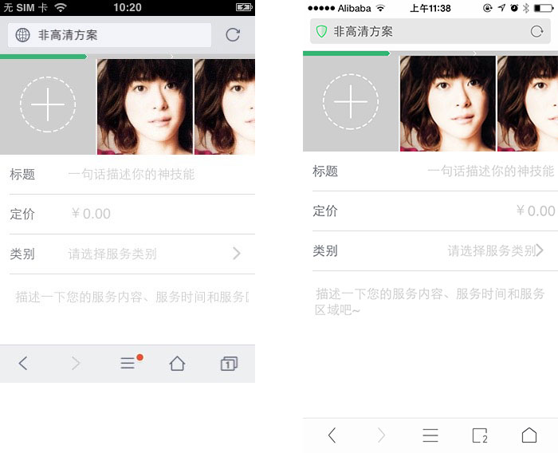
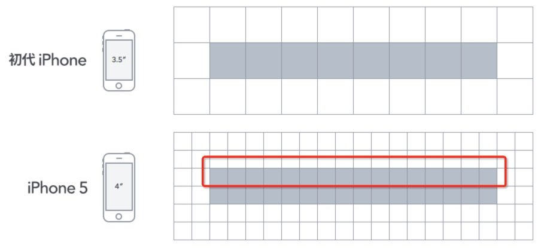

## 一、移动端为什么要做适配  
移动端虽然整体来说大部分浏览器内核都是webkit，而且大部分都支持CSS3的所有语法。但是，由于手机屏幕尺寸不一样，分辨率不一样，这时候你也就不得不解决在不同手机上，不同情况下的展示效果了。另外一点，UI一般输出的视觉稿只有一份，比如淘宝就会输出：750px 宽度的（高度是动态的一般不考虑），这时候开发人员就不得不针对这一份设计稿，让其在不同屏幕宽度下显示一致。  
一致是什么意思？就是下面提到的几个主要解决的问题。
## 二、移动端适配主要解决的问题  
1. 元素自适应问题
2. 文字rem问题
3. 高清图问题
4. 1像素问题
## 三、基本概念
- 视觉稿  
UI给我们的PSD文件称为视觉稿，对于移动开发而言，为了做到页面高清的效果，视觉稿的规范往往会遵循以下两点：
1. 首先，选取一款手机的屏幕宽高作为基准（[查看如何选择基准](https://www.jianshu.com/p/85b7afece910)）,如iPhone6的375 * 667
2. 对于retina屏幕（dpr = 2）,为了达到高清效果，视觉稿的画布大小会是基准的2倍，也就是说像素点是原来的4倍，如对于iPhone6的375 * 667，就会变成750 * 1334
- 物理像素  
一个物理像素是显示器上最小的物理显示单元，在操作系统的调度下，每一个设备像素都有自己的颜色值和亮度
- 设备独立像素
设备独立像素（也叫密度无关像素），可以认为是计算机坐标系统中的一个点，这个点代表一个可以由程序使用的虚拟像素(比如：CSS像素)，然后由相关系统转换为物理像素
- 设备像素比
设备像素比(dpr)定义了物理像素和设备独立像素的的对应关系，它的值可以按如下公式得出:  
```js
设备像素比 = 物理像素 / 设备独立像素 // 在某一方向上，x反向或y方向
```
在JavaScript中，可以通过window.devicePixelRatio获取到当前设备的dpr.在CSS中，可以通过-webkit-device-pixel-ratio，-webkit-min-device-pixel-ratio和 -webkit-max-device-pixel-ratio进行媒体查询，对不同dpr设备，做一些样式适配  
综合上面介个概念，一起举例说明下:   
以iPhone6为例：
1. 设备宽高为375✖667，可以理解为设备独立像素
2. dpr为2，根据上面的公式，其物理像素✖2，为750✖1334  
用一张图来表现:  

从上图中可以看出,对于这样的css样式:
```js
width: 2px;
height: 2px;
```
在不同的屏幕上(普通屏 vs retina屏)，css像素所呈现的大小（物理尺寸）是一致的,不同的是1个CSS像素所对应的物理像素个数是不一致的。  
在普通屏下，一个CSS像素一个物理像素（1：1），在retina屏幕下，一个css像素对应4个物理像素（1：4)  
- 位图像素  
一个位图像素是栅格图像（如:png,jpg,git等）最小的数据单元。每一个位图像素都包含着一些自身的显示信息（如：显示位置，颜色值，透明度等）  
谈到这里，就得说一下，retina下图片的显示情况  
理论上，一个css像素对应一个物理像素，图片才能完美清晰的展示。  
这在普通屏幕下是没有问题的，但是在retina屏幕下就会位图像素点不够，从而导致图片模糊的情况.  
用一张图来表示:

如上图: 对于dpr=2的retina屏幕而言,一个位图像素对于与4个物理像素，由于单个位图像素不可以再进一步分割，所以只能就近取色，从而导致图片模糊  
所以，对于图片高清问题，比较好的发案就是两倍图片(@2✖)  
如: 200✖300img标签,就需要提供400✖600的图片  
如此一来，位图像素点个素就是原来的4倍，在retina屏幕下，位图像素点个数就能和物理像素点个素形成1：1的比例，图片自然就清晰了（这也就解释了之前留下的一个问题，为啥视觉稿的画布大小✖2了）  
这里还有一个问题，普通屏幕下也用了2倍图会怎么样呢？  
很明显，在普通屏幕下，200*300img标签，所对应的物理像素个数就是200 * 300个，而两倍图片的位图像素个数就是200 * 300 * 4，所以出现一个物理像素点对应4个位图像素点，所以他们的取色只能通过一定的算法（显示结果就是一张只有原图像总数四分之一，我们称这个过程角downsampling）,肉眼看上去虽然图片不会模糊，但是总感觉图片缺少一点锐利度，或者是有点色差  
用一张图来表示:

针对上面的两个问题，来看demo:

demo中，100*100的图片，分别放在100*100，50 *50， 25 * 25的img容器中，在retina屏幕下的效果.  
条形图。通过放大镜可以看出边界像素点的取值不同  
- 图1，就近取色，色值介于红白之间，偏淡，图片看上去会模糊。
- 图2，没有就近取色，色值要么是红要么是白，图片看上去很清晰。 
- 图3，就近取色，色值介于红白之间，偏重，图片看上去有色差，缺少锐利度
## 四、经典问题
### retina下，图片高清问题
两倍图片(@2✖)，然后图片容器缩小50%  
如: 图片大小400✖600；  
1. img标签
```js
width: 200px;
height: 300px;
```
2. 背景图片  
```js
width: 200px;
height: 300px;
background-image: url(img@2✖)
background-size: 200px 300px; 
```
这样的缺点很明显,在普通屏下:  
1. 同样下载了@2✖图，造成资源浪费
2. 图片由于downsampling,会失去一些锐利度  

所以，最好的解决方案，在不同的dpr下，加载不同的尺寸的图片  
不管是通过css媒体查询，还是通过javascript条件判断都是可以的  
- retina下，border: 1px问题  
我们正常的写css，像这样border:1px,在retina下，会有什么问题？

上面两张图分别是在dpr=1和dpr=2下面的测试结果，对于一条1px宽的直线，它们在屏幕上的物理尺寸的确是相同的。

不同的其实是屏幕上最小的物理单元显示，对于一条直线，dpr=2的手机，他能显示的最小宽度其实是图中的红线圈出来的部分，用css来表示，理论上是0.5px  
所以，设计师想要的retina下border:1px;其实就是1物理像素宽，对于css而言，可以认为是broder: 0.5px;这是retina下dpr=2能显示的最小单位  
最简单的一个做法就是这样（元素scale）：
```js
.scale{
    position: relative;
}
.scale::after{
    content: "";
    position: absolute;
    bottom: 0px;
    left: 0px;
    right: 0px;
    border-bottom: 1px solid #fff;
    transform: scaleY(0.5)
    transform-origin: 0 0;
}
```
这样的hack方法不够通用(圆角等)  
这里推荐的发案是页面scale的方案，几乎满足所有的场景  
对于iphone5(dpr=2)，添加如下的meta标签，设置viewport(scale 0.5)
```js
<meta name="viewport" content="width=640,initial-scale=0.5,maximum-scale=0.5, minimum-scale=0.5,user-scalable=no">
```
这样页面中的border: 1px;都将缩小0.5，从而达到border:0.5px效果；  
然而，页面scale,必然会带来一些问题:  
1. 字体大小会被缩放
2. 页面布局会被缩放(如：div的宽高等)

### 多屏适配布局问题  
移动端布局，为了适配各种大屏手机，目前最好的方案莫过于使用相对单位rem  
基于rem原理，我们要做的就是:针对不同屏幕尺寸和dpr动态的改变根节点html的font-size大小（基准值）  
这里我们提取了一个公式（rem基准值）  
```js
rem = document.documentElement.clientWidth * dpr / 10
```
说明:  
1. 乘以dpr,是应为页面可能为了实现1px border,页面会缩放1/dpr倍
2. 除以10，是为了取整，方便计算  
所以就像下面这样，html的font-size可能会:  
iphone3g: 320px / 10 = 32px  
iphone4/5: 320px * 2 / 10 = 62px  
iphone6: 375px * 2 / 10 = 75px  
对于动态改变html的font-size,我们可以通过css做，也可以通过JavaScript做。  
css方式，我们可以通过设备宽度来媒体查询改变html的font-size  
```js
html{font-size: 32px;}
//iphone 6 
@media (min-device-width : 375px) {
   html{font-size: 64px;}
}
// iphone6 plus 
@media (min-device-width : 414px) {
    html{font-size: 75px;}
}
```
缺点: 通过设备宽度范围区间这样的媒体查询来动态改变rem基准值，其实不够精确，比如: 宽度为320px和宽度为360px的手机，因为屏幕宽度在同一范围区间内(< 375px), 所以会被同等对待(rem基准值相同),而事实上他们的屏幕宽度不相同，他们的布局也应该有所不同。最终，结论就是，这样的做法，没有做到足够精确，但是够用  
javascript方式，通过上面的公式，计算基准rem，然后写入样式，大概如下：
```js
var dpr,rem,scale
var docEl = document.documentElement
var fontEl = document.createElement('style')
var metaEl = document.querySelector('meta[name="viewport"]')
dpr = window.devicePixelRatio || 1
rem = docEl.clientWidth * dpr / 10
scale = 1 / dpr
// 设置viewport, 进行缩放，达到高清效果
metaEl.setAttribute('content', 'width=device-width'',initial-scale=' + scale + ',maximum-scale=' + scale + ', minimum-scale=' + scale + ',user-scalable=no')
// 设置 data-dpr属性，留作css hack之用
docEl.setAttribute('data-dpr', dpr)
//动态写入样式
docEl.firstElementChild.appendChild(fontEl);
fontEl.innerHTML = 'html{font-size:' + rem + 'px!important;}';

// 给js调用的，某一dpr下rem和px之间的转换函数
window.rem2px = function(v) {
    v = parseFloat(v);
    return v * rem;
};
window.px2rem = function(v) {
    v = parseFloat(v);
    return v / rem;
};

window.dpr = dpr;
window.rem = rem;
```
这种方式，可以精确的算出不同屏幕所应有的rem基准值，缺点就是要加载这段js代码，但个人觉得这是目前最好的方案  
因为这个方案同时解决了三个问题
1. border 1px 问题
2. 图片高清问题
3. 屏幕适配布局问题  

说道布局，如何在css编码中还原视觉稿的真实宽高？  
前提条件:  
1. 拿到的是一个针对iphone6的高清视觉稿750 * 1334
2. 采用上述的高清方案  


如果有个区块，在psd文件中量出750 * 300px的div,那么它改如何转换成rem单位呢？  
公式如下: 
```js
rem = px / 基准值
```
对于一个iPhone6的视觉稿，它的基准值就是75；  
所以，在确定了视觉稿之后（即确定了基准值），通常我们会用less写一个mixin，像这样:  
```js
.px2rem(@name, @px){
    @{name}: @px / 75 * 1rem
}
```
所以，对于宽高750 * 300pxdiv, 我们用less就这样写:
```js
.px2rem(width, 750)
.px2rem(height, 300)
```
装换成html就这样
```js
width: 100rem;
height: 4rem;
```
最后，应为dpr=2,页面scale了0.5,所以在手机屏幕上显示的真实宽高应该是375px * 150px,就刚刚好  
倘若页面没有scale 0.5,我们的代码应该这样  
```js
.px2rem(width, 375)
.px2rem(height, 150)
```
这样的宽高我们往往这样得来  
1. 将750×1334的视觉稿转成375×667的大小后，再去量这个区块的大小(感觉好傻)。
2. 在750×1334量得区块宽高是750×300px后，再口算除以2(感觉好麻烦)。  

### 字体大小的问题 
 既然上面的方案会使得页面缩放scale，对于页面区块的宽高，我们可以依赖视觉稿，因为视觉稿本来就*2了，我们直接量就是了，那么对于字体我们该如何处理呢？

 对于字体缩放问题，设计师原本要求是这样的: 任何手机屏幕上字体大小都要统一，所以我们针对不同的dpr,会做如下处理：  
 ```js
 font-size: 16px;
 [data-dpr="2"] input{
     font-size: 32px;
 }
 ```
 注意，字体大小不可以用rem,误差太大了，且不能满足任何屏幕下字体大小相同
 ```js
 .px2px(@name, @px){
    @{name}: round(@px / 2) * 1px;
    [data-dpr="2"] & {
        @{name}: @px * 1px;
    }
    // for mx3
    [data-dpr="2.5"] & {
        @{name}: round(@px * 2.5 / 2) * 1px;
    }
    // for 小米note
    [data-dpr="2.75"] & {
        @{name}: round(@px * 2.75 / 2) * 1px;
    }
    [data-dpr="3"] & {
        @{name}: round(@px / 2 * 3) * 1px
    }
    // for 三星note4
    [data-dpr="4"] & {
        @{name}: @px * 2px;
    }
}
 ```
注意，html的data-dpr属性就是之前js方案里面提到的，这里就有用处了  
用的时候，就像这样
```js
px2px(font-size, 32)
```
对于其他css属性，如果也要求不同dpr下保持一致的话，也可以这样操作，如:
```js
.px2px(padding, 20)
.px2px(right, 8)
```
参考文章:  
[移动端高清、多屏适配方案](http://www.html-js.com/article/Mobile-terminal-H5-mobile-terminal-HD-multi-screen-adaptation-scheme%203041)  
[移动端H5解惑-页面适配](https://github.com/sunmaobin/sunmaobin.github.io/issues/28)  
[细说移动端 经典的REM布局 与 新秀VW布局](https://cloud.tencent.com/developer/article/1352187)