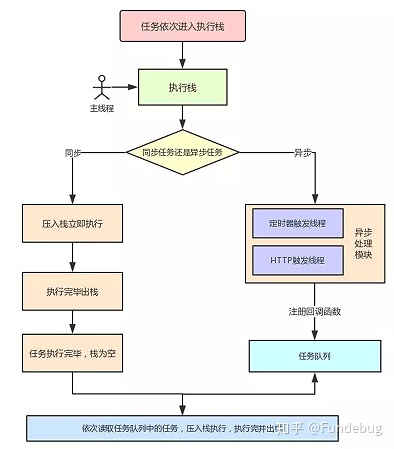
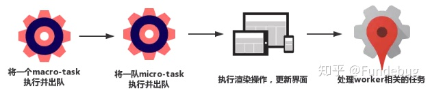
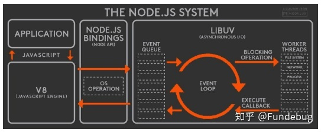
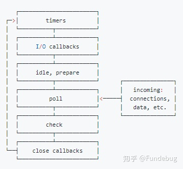

### 在浏览器和node中事件循环(EventLoop)其实是不同的，接下里将解析在浏览器和node中的JS异步实现原理
## 基本概念
一、线程与进程  
1. 概念  
我们常说js是单线程执行的，指的是一个进程里只有一个主线程，那到底什么事线程？什么事进程呢？  
官方的说法:进程是CPU资源分配的最小单元，线程是CPU调度的最小单元。一个进程由一个或多个线程组成，线程是一个进程中代码执行的不同路线。进程的内存空间是共享的，每个线程都可以使用这些共享内存
2. 多进程和多线程  
- 多进程: 在同一时间里，同一个计算机系统里允许两个或两个以上的进程处于运行状态。多进程带来的好处是明显的，比如你可以听歌的同时写代码。
- 多线程: 程序中包含多个执行流，即在一个程序中可以同时运行多个不同的线程来执行不同的任务，也就是说允许单个程序创建多个并行的线程来完成各自的任务。
以Chrome为例，当你打开一个tab页时，其实就创建了一个进程，一个进程中可以有多个线程。比如:渲染线程、JS引擎线程、HTTP请求线程等待。当你发起一个请求时就是创建了一个线程，当请求结束时，该线程可能就会被销毁。
二、浏览器内核
简单来说浏览器内核是通过取得页面内容、整理信息、计算和组合最终输出可视化的图像结果，通常被称为渲染引擎  
浏览器内核是多线程，在内核控制下各个线程互相配合保持同步，一个浏览器通常由以下常驻线程组成:
- GUI渲染线程
- JavaScript引擎线程
- 定时触发线程
- 事件触发线程
- 异步http请求线程
1. GUI渲染线程
- 主要负责页面的渲染，解析html、Css、构建DOM树,布局和绘制等。
- 当页面需要重绘或者由于某种操作引发回流时，将执行该线程。
- 该线程与JS引擎线程互斥，当执行JS引擎线程时，GUI渲染线程将会被挂起，当任务队列空闲时，JS引擎才回去执行GUI渲染
2. JS引擎线程
- 该线程当然是主要负责处理JavaScript脚本，执行代码
- 也是主要负责执行准备好待执行的事件，即定时器计数结束或者异步请求成功并正确返回时，将依次进入任务队列，等待JS引擎线程执行。
- 当然，该线程与GUI渲染线程互斥，当JS引擎线程执行JavaScript脚本时间过长，将导致页面渲染的阻塞
3. 定时器触发线程
- 负责执行异步定时器一类的函数的线程。如:setTimeout、setInterval
- 主线程依次执行代码时，遇到定时器，会将定时器交给该线程处理，当计数完毕，事件触发线程会将计数完毕的事件加入到任务队列的尾部。等待JS引擎线程执行
4. 事件触发线程
- 主要负责将准备好的事件交给JS引擎线程执行
5. 异步Http请求线程
- 负责执行异步请求一类的函数的线程。如: Promise,axios,ajax等
- 主线程依次执行代码时，遇到异步请求，会将函数交给该线程处理，当监听到状态码变更，如果有回调函数，事件触发线程会将回调函数加入到任务队列的尾部，等待JS引擎线程的执行
三、浏览器中的事件循环
1.Micro-Task和Macro-Task
事件循环中的异步队列有两种:macro(宏任务)队列和micro(微任务)队列。宏任务队列可以有多个，微任务队列只有一个。
- 常见的宏任务：setTimeout、setInterval、script(整体代码)、I/O操作、UI渲染等
- 常见的微任务:process.nextTick、new Promise.then(回调)、MutationObserver等
2.事件循环（EventLoop）过程解析    
一个完整的事件循环过程，可概括为以下阶段:

- 一开始执行栈为空，我们可以把执行栈认为是一个存储函数调用栈的结构，遵循先进后出的原则。微任务队列空，宏任务队列有且只有一个script脚本（整体代码）
- 全局上下文（script标签）被推入执行栈，同步代码执行。在执行的过程中，会判断是同步任务还是异步任务，通过对一些接口的调用，会产生新的宏任务和微任务，它们会分别被推入到各自的任务队列里。同步代码执行完了，script脚本会被移除宏任务队列，这个过程本质上是宏任务的执行和出队的过程
- 上一步我们出队的是一个宏任务，这一步我们处理的是微任务。但需要注意的是，宏任务出队列时，任务是一个一个执行的。而微任务出队时，任务是一队一队执行的。因此，我们处理微任务队列这一步，会逐个执行队列中的任务并把它出队，直到队列清空。
- 执行渲染操作，更新界面
- 检查是否存在web work任务，如果有，则对其进行处理。
- 上述过程往复，直到队列被清空  
我们总结一下，每一次循环都是一个这样的过程:
  
当某个宏任务执行完后，会检查看是否有微任务队列。如果有，先执行微任务队列中的所有任务，如果没有，会读取宏任务队列中排在最前的任务，执行宏任务的过程中，遇到微任务，一次加入微任务队列中。栈空后，再次读取微任务队列中的所有任务，依次类推。  
```js
Promise.resolve().then(()=>{
    console.log('Promise1')
    setTimeout(()=>{
        console.log('setTimeout2')
    }, 0)
})
setTimeout(()=>{
    console.log('setTimeout1')
    Promise.resolve().then(()=>{
        console.log('Promise2')
    })
},0)
```
最后输出结果是 Promise1，setTimeout1，Promise2，setTimeout2
- 一开始执行栈的同步任务（属于宏任务）执行完毕，回去查看是否有微任务队列，代码中存在(有且只有一个)，然后执行微任务队列中的所有任务输出Promise1,同时会生成一个宏任务setTimeout2
- 然后去检查宏任务队列，宏任务setTimeout1在setTimeout2之前，先执行宏任务setTimeout1，输出setTimeout1
- 在执行宏任务setTimeout1时，会生成微任务Promise2,放入微任务队列中，接着去清空微任务队列中的所有任务，输出Promise2
- 清空微任务队列中的所有任务后，又去宏任务队列中取一个setTimeout2,输出setTimeout2
四、Node中的事件循环
1. Node简介  
Node中的事件循环和浏览器中的是完全不相同的东西。Node.js采用V8作为js的解析引擎，而I/O处理方面使用了自己设计的libuv,libuv是一个基于事件驱动的跨平台抽象层，封装了不同操作系统一些底层特效，对外提供统一的API,事件循环机制也是它里面的实现
 
Node.js的运行机制如下:
- V8引擎解析JS脚本
- 解析后的代码调用NodeAPI
- libuv库负责NodeAPI的执行，它将不同的任务分配给不同的线程，形成一个事件循环。以异步的方式将任务的执行结果返回给V8引擎
- V8引擎再将结果返回给用户  
2. 六个阶段  
其中libuv引擎的事件循环分为六个阶段，它们会按照顺序反复运行。每当进去某个阶段，就会从对应的队列中取出函数取执行。当队列为空或者执行的回调函数数量达到系统设定的阈值，就会进入下一阶段
 
从图中，大致看出node中事件循环的顺序：  
外部输入数据-》轮询阶段-》检查阶段-》关闭事件回调阶段-》定时器检测阶段-》I/O事件回调阶段-》闲置阶段-》轮询阶段（按照该顺序反复运行）...  
- timer阶段：这个阶段执行timer（setTimeout、setInterval）的回调
- I/O callbacks阶段: 处理一些上一轮循环中的少数未执行的I/O回调
- idle,prepare阶段: 仅node内部使用
- poll阶段: 获取新的I/O事件，适当的条件下node将阻塞在这里
- check阶段:执行setImmediate回调
- close callback阶段: 执行socket的close事件回调  
注意；上面六个阶段不包括process.nextTick()  
接下来我们详细介绍timers、poll、check这三个阶段，因为日常开发中的绝大部分异步任务都是在这三个阶段处理的  
i、timers  
timers阶段会执行setTimeout和setInterval回调，并且是由poll阶段控制的。同样，在node中指定的时间也不是准确时间，只能是尽快执行  
ii、poll  
poll是一个至关重要的阶段，这一阶段系统会做两件事情  
- 回到timers阶段执行回调
- 执行I/O回调  
并且在进入该阶段如果没有设定了timer的话，会发生以下两件事情  
- 如果poll队列不为空，会遍历队列并同步执行，知道队列为空或达到系统限制 
- 如果队列为空时，会发生两件事情  
- 如果有setImmediate回调需要执行，poll阶段会停止并且进入到check阶段执行回调
- 如果没有setImmedidate回调需要执行，会等待回调加入队列中并立即执行回调，这里同样会有一个超时时间设置防止一直等待下去  
当然设定了timer话且poll队列为空，则会判断是否有timer超时，如果有的话会回到timer阶段执行回调  
iii、check阶段  
setImmediate回调会被加入到check队列中，从事件循环的阶段图中可以看到，check阶段的执行顺序在poll阶段之后
```js
console.log('start')
setTimeout(() => {
  console.log('timer1')
  Promise.resolve().then(function() {
    console.log('promise1')
  })
}, 0)
setTimeout(() => {
  console.log('timer2')
  Promise.resolve().then(function() {
    console.log('promise2')
  })
}, 0)
Promise.resolve().then(function() {
  console.log('promise3')
})
console.log('end')
//start=>end=>promise3=>timer1=>timer2=>promise1=>promise2
```
- 一开始执行栈的同步任务(宏任务)执行完毕后(依次打印出start end, 并将2个timer依次放入timer队列)，会先去执行微任务(这点跟浏览器一样),所以答应出promise3
- 然后进入timers阶段，执行timer1的回调函数，打印timer1,并将promise.then回调放入微任务队列，同样的步骤执行timer2,打印timer2.这点跟浏览器差别比较大。timers阶段有几个setTimeout/setInterval都会依次执行，并不像浏览器，每执行一个宏任务就去执行微任务
