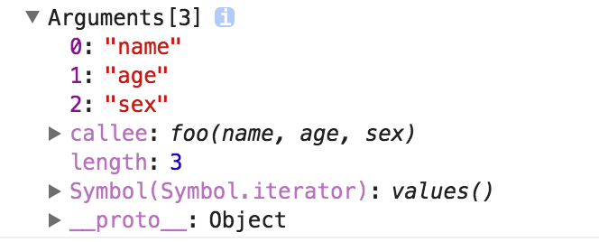

## 类数组对象
所谓的类数组对象
> 拥有length属性和若干索引属性的对象
举个例子：
```js
var arr = ['name', 'age', 'sex']
var arrLike = {
    0: 'name',
    1: 'age',
    2: 'sex',
    length: 3
}
```
即便如此，为什么叫做类数组对象呢？
那让我们从读写、获取长度、遍历三个方面看看这两个对象
### 读写
```js
console.log(arr[0]) // name
console.log(arrLike[0]) // name

arr[0] = 'new name'
arrLike[0] = 'new name'
```
### 长度
```js
console.log(arr.length) // 3
console.log(arrLike.length) // 3
```
### 遍历
```js
for(var i = 0, len = array.length; i < len; i++) {
   ……
}
for(var i = 0, len = arrayLike.length; i < len; i++) {
    ……
}

```
是不是很像？
那类数组对象可以使用数组方法吗？比如
```js
arrLike.push('23')
```
上述代码会报错：arrLike.push is not a function
所以终归还是类数组呐...
### 调用数组方法
如果类数组就是任性的想用数组方法怎么办？
既然无法使用我们可以用Function.call间接调用:
```js
var arrLike = {0: 'name', 1: 'age', 2: 'sex', length: 3}
Array.prototype.join.call(arrLike, '&') // name&age&sex
Array.prototype.slice.call(arrLike, 0) // ['name', 'age', 'sex']
//slice可以做到类数组转数组
Array.prototype.map.call(arrLike, function(item){
    return item.toUpperCase()
})
// ["NAME", "AGE", "SEX"]
```
### 类数组转数组
上面的例子中已经提到了一种类数组转数组的方法，再补充三个:
```js
var arrLike = {0: 'name', 1: 'age', 2: 'sex', length: 3 }
Array.prototype.slice.call(arrLike) // ["name", "age", "sex"]

Array.prototype.splice.call(arrLike, 0) // ["name", "age", "sex"]
Array.from(arrLike) // ["name", "age", "sex"]
Array.prototype.concat.apply([], arrLike) // ["name", "age", "sex"]
```
那么为什么会讲到类数组对象呢？以及类数组对象有什么应用？
要说到类数组对象，arguments就是一个类数组对象。在客户端JavaScript中，一些DOM方法(document.getElementsByTagName()等)，也返回类数组对象  
### Arguments对象
就下来重点讲讲arguments对象  
Arguments对象只定义在函数中，包括了函数的参数和其他属性。在函数中，arguments指代函数的Arguments对象。  
举个例子：
```js
function foo(name, age, sex){
    console.log(arguments)
}
foo('tangem', 29, 'man')
```
打印结果如下：

我们看到除了类数组的索引属性和length属性之外，还有一个callee属性，接下来我们一个个介绍：
### length属性
Arguments对象的length属性，表示实参的长度，举个例子
```js
function foo(a, b , c){
    console.log('实参的长度: ' + arguments.length)
}
console.log('形参的长度: ' + foo.length)
foo(1)
// 形参的长度为: 3
// 实参的长度为: 1
```
### callee属性
Arguments对象的callee属性，通过它可以调用函数自身
讲个闭包经典面试题使用callee的解决方法:
```js
var data = []
for(var i =0; i < 3; i++){
    (data[i] = function(){
        console.log(arguments.callee.i)
    }).i = i
}
data[0]()
data[1]()
data[2]()
// 0
// 1
// 2
```
接下来讲讲arguments对象的几个注意要点:
### arguments和对应参数的绑定
```js
function foo(name, age, sex, hobbit){
    console.log(name, arguments[0]) // name ,name
    // 改变形参
    name = 'new name'
    console.log(name, arguments[0]) // new name new name
    // 改变arguments
    arguments[1] = 'new age'
    console.log(age, arguments[1]) // new age new age

    // 测试未传入的是否会绑定
    console.log(sex) // undefined
    sex = 'new sex'
    console.log(sex, arguments[2]) // new sex undefined
    arguments[3] = 'new hobbit'
    console.log(hobbit, arguments[3]) // undefined new hobbit
}
foo('name', 'age')
```
传入的参数，实参和arguments的值会共享，当没有传入时，实参与arguments不共享  
除此之外，以上是在非严格模式下，如果在严格模式下，实参和arguments是不会共享

### 传递参数
将参数从一个函数传递到另一个函数
// 使用apply将foo的参数传递给bar
```js
function foo(){
    bar.apply(this, arguments)
}
function bar(a, b, c){
    console.log(this)
    console.log(a,b,c)
}
foo(1,2,3)
```
### 强大的ES6
使用ES6的...运算符，我们可以轻松转成数组
```js
function foo(...arguments){
    console.log(arguments) // [1, 2, 3]
}
foo(1, 2, 3)
```
### 应用
1. 参数不定长
2. 函数柯里化
3. 递归调用
4. 函数重载

