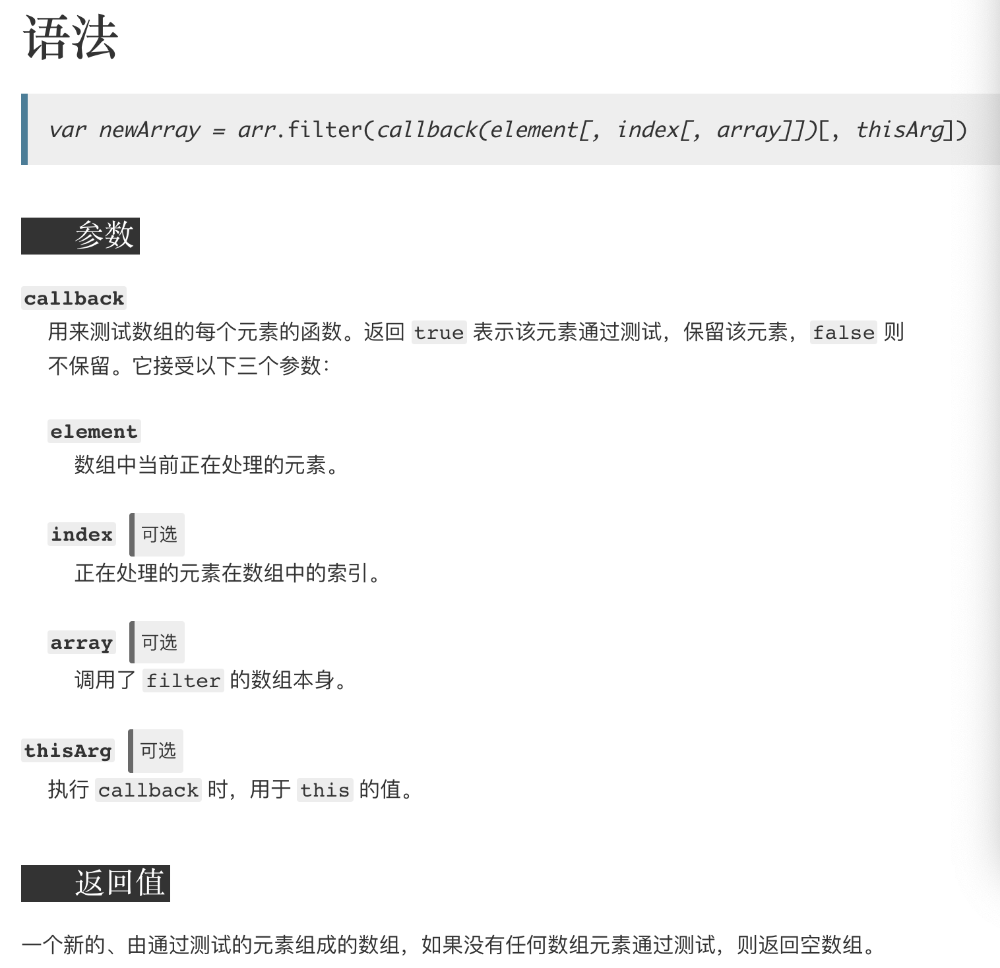
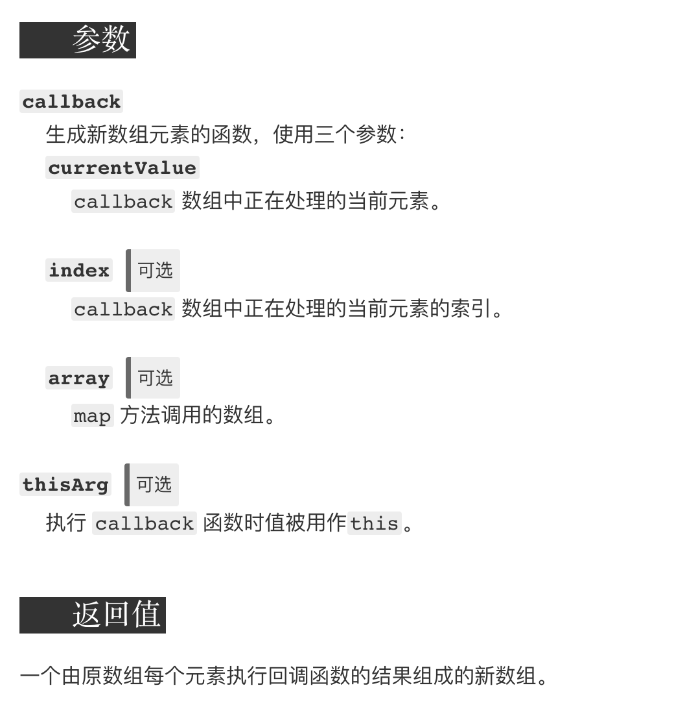
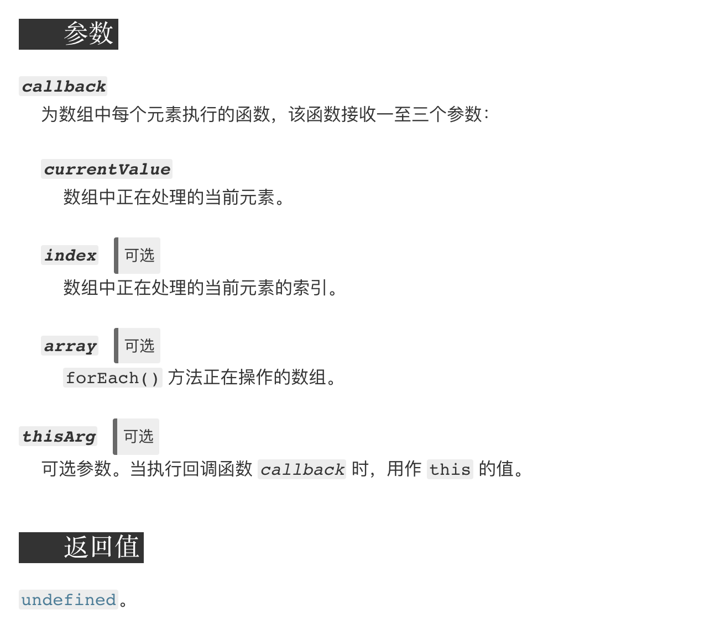
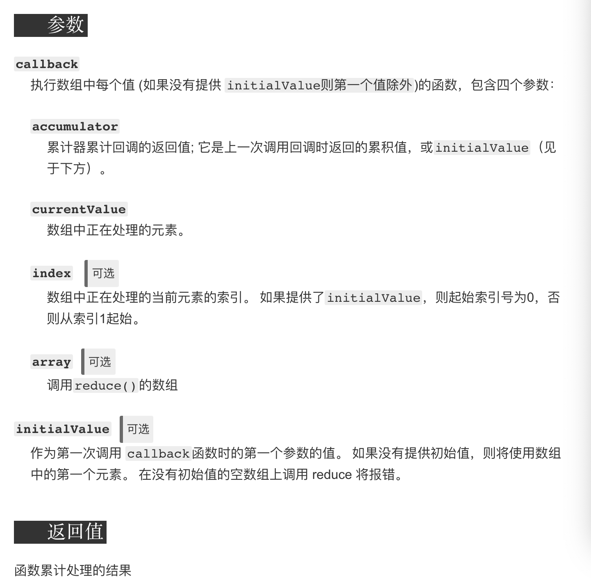

# 数组扁平化
数组扁平化是指将一个多维数组变为一个一维数组
```js
const arr = [1, [2, [3, [4, 5]]], 6];
// => [1, 2, 3, 4, 5, 6]
```
## 方法一：使用flat()
```js
const res = arr.flat(Infinity)
```
## 方法二：利用正则
```js
JSON.stringify(arr).replace(/\[|\]/g, '').split(',')
//但数据类型都会变为字符串
```
## 方法三：正则改良版本
```js
const res3 = JSON.parse('[' +JSON.stringify(arr).replace(/\[|\]/g, '')+']')
```
## 方法四：使用reduce
```js
function flatWithReduce(arr){
    return arr.reduce((pre, cur) => {
        return pre.concat(Array.isArray(cur) ? flatWithReduce(cur): cur)
    }, [])
}
```
## 方法五：函数递归
```js
function flatFn(arr){
    const ret = []
    arr.forEach(item => {
        Array.isArray(item) ? ret.concat(flatFn(item)): ret.push(item)
    })
    return ret
}
```
# 02.数组去重
```js
const arr = [1, 1, '1', 17, true, true, false, false, 'true', 'a', {}, {}];
// => [1, '1', 17, true, false, 'true', 'a', {}, {}]

```

## 方法一：利用Set
```js
Array.from(new Set(arr))
```
## 方法二：两层for循环+splice
```js
function uniqueArr(arr){
    let len = arr.length
    for(let i = 0; i< len;i++){
        for(let j = i+1; j<len;j++){
            if(arr[i] === arr[j]){
                arr.splice(j,1)
                len--
                j--
            }
        }
    }
    return arr
}
uniqueArr(arr)
```
## 方法三：利用indexOf
```js
function uniqueArr(arr){
    let res = []
    for(let i =0;i<arr.length;i++){
        if(res.indexOf(arr[i]) === -1) res.push(arr[i])
    }
}
uniqueArr(arr)
```

## 方法四：利用include
```js
function uniqueArr(arr){
     let res = []
    for(let i =0;i<arr.length;i++){
        if(!res.includes(arr[i])) res.push(arr[i])
    }
}
```
## 利用filter
```js
function uniqueArr(arr){
     return arr.filter((item,idx) => {
         return arr.indexOf(item) === idx
     })
}
```
## 方法六：利用Map
```js
function uniqueArr(arr){
    const map = new Map()
    const ret = []
    for(let i = 0; i< arr.length; i++){
        if(!map.has(arr[i])){
            ret.push(arr[i])
            map.set(arr[i], true)
        }
    }
    return res;
}
```
# 03.类数组转化为数组
类数组是具有length属性，但不具有数组原型上的方法。常见的类数组有arguments、DOM操作方法返回的结果。
## 方法一：Array.from
```js
Array.from(document.querySelectorAll('div'))
```
## 方法二：Array.prototype.slice.call()
```js
Array.prototype.slice.call(document.querySelectorAll('div'))
```
## 方法三：扩展运算符
```js
[...document.querySelectorAll('div')]
```
## 方法四：利用concat
```js
Array.prototype.concat.apply([], document.querySelectorAll('div'));

```
# 04.Array.prototype.filter()

```js
Array.prototype.myFilter = function(callback, thisArg){
    if(this === undefined){
        throw new TypeError('this is null or not defined');
    }
    if(typeof callback !== 'function'){
        throw new TypeError(callback + ' is not a function');
    }
    const res = []
    const o = Object(this)
    for(let i =0; i<o.length; i++){
        if(callback.call(thisArg, o[i], i, this)){
            res.push(o[i])
        }
    }

    return res
}
let arr = [1,2,3,4,5,6]
arr.myFilter(function(cur,idx){
    return cur > 3
})
```
## 05.Array.prototype.map()

```js
Array.prototype.myMap = function(callback, thisArg){
    if(this === undefined){
        throw new TypeError('this is null or not defined');
    }
    if(typeof callback !== 'function'){
        throw new TypeError(callback + ' is not a function');
    }
    const len = this.length
    const res = []
    const o = Object(this)
    for(let i = 0;i< len;i++){
        res[i] = callback.call(thisArg, o[i], i, this)
    }
    return res
}
```
## 06.Array.prototype.forEach()

```js
Array.prototype.myForEach = function(callback, thisArg){
    if(this === undefined){
        throw new TypeError('this is null or not defined');
    }
    if(typeof callback !== 'function'){
        throw new TypeError(callback + ' is not a function');
    }
    const len = this.length
    const res = []
    const o = Object(this)
    for(let i = 0;i< len;i++){
        callback.call(thisArg, o[i], i, o);
    }
}
```
## 07.Array.prototype.reduce()


```js
Array.prototype.myReduce = function(callback, initialValue){
    if (this === undefined) {
        throw new TypeError('this is null or not defined');
    }
    if (typeof callback !== 'function') {
        throw new TypeError(callback + ' is not a function');
    }
    const o = Object(this);
    const len = o.length;
    let pre = initialValue
    let k = 0
    if(initialValue === undefined){
        while(k < len && !(k in o)){
            k++
        }
        if(k >= len){
            throw new TypeError('Reduce of empty array with no initial value')
        }
        pre = o[k++]
    }
    while(k < len ){
        if(k in o){
            pre = callback.call(undefined, pre, o[k], k, o);
        }
        k++
    }
    return pre
}
const arr = []
arr[100] = 1
let ret = arr.myReduce(function(pre, cur){
    return pre +  cur
}, 10)
console.log(ret)
```
## 08.Function.prototype.apply()
第一个参数是绑定的this，默认为window，第二个参数是数组或类数组
```js
Function.prototype.myApply = function(context = window, args = []){
    if(typeof this !== 'function'){
        throw new TypeError('Type Error')
    }
    const fn = Symbol('fn')
    context[fn] = this
    const ret = context[fn](...args)
    delete context[fn]
    return ret
}
function hello(){
    var name = 'tangem'
    console.log(this.name)
}
hello.myApply()
```
## 09.Function.prototype.call
```js
Function.prototype.myCall = function(context = window, ...args){
    if(typeof this !== 'function'){
        throw new TypeError('Type Error')
    }
    const fn = Symbol('fn')
    context[fn] = this
    const ret = context[fn](...args)
    delete context[fn]
    return ret
}
```
## 10.Function.prototype.bind
```js
Function.prototype.myBind = function(thisArgs){
    const self = this
    const args = [].slice.call(arguments, 1)
    const bindFn =  function(){
        const bindArgs = [].slice.call(arguments)
        return self.call(this instanceof self ? this: thisArgs, args.concat(bindArgs))
    }
    let tmpFn = function(){}
    tmpFn.prototype = self.prototype
    bindFn.prototype = tmpFn
    return bindFn
}
var obj = {
    z: 1
};

function fn(x, y) {
    this.name = '听风是风';
    console.log(this.z);
    console.log(x);
    console.log(y);
};
fn.prototype.age = 26;
var bound = fn.myBind(obj,2,3)
bound()
```
## 11.debounce（防抖）
触发高频时间后n秒内函数只会执行一次,如果n秒内高频时间再次触发,则重新计算时间。
```js
const debounce = function(fn, time){
    let timer = null
    return function(){
        clearTimeout(timer)
        timer = setTimeout(()=> {
            fn.apply(this, arguments)
        }, time)
    }
}
```
防抖常应用于用户进行搜索输入节约请求资源，window触发resize事件时进行防抖只触发一次。
## 12.throttle（节流）
```js
const throttle = function(fn, time){
    let flag = true
    return function(){
        if(!flag) return
        flag = false
        setTimeout(()=>{
            fn.apply(this, arguments)
            flag = true
        }, time)
    }
}
```
## 13.函数珂里化
指的是将一个接受多个参数的函数 变为 接受一个参数返回一个函数的固定形式，这样便于再次调用，例如f(1)(2)  
经典面试题：实现add(1)(2)(3)(4)=10; 、 add(1)(1,2,3)(2)=9;
```js
function add(){
    const _args = [...arguments]
    function fn(){
        _args.push(...arguments)
        return fn
    }
    f.toString = function(){
        return _args.reduce((sum, cur)=> {
            return sum + cur
        }
    }
    return _args
}
```
## 14.模拟new操作